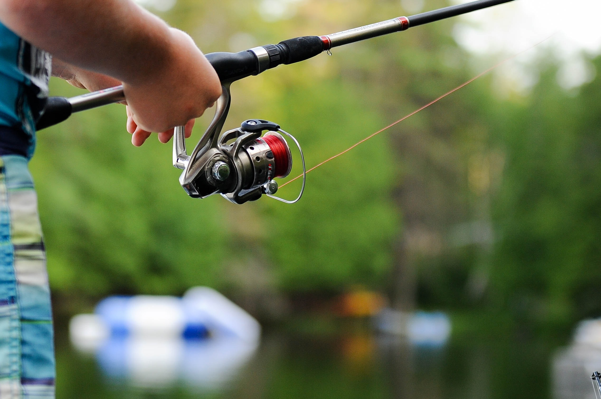
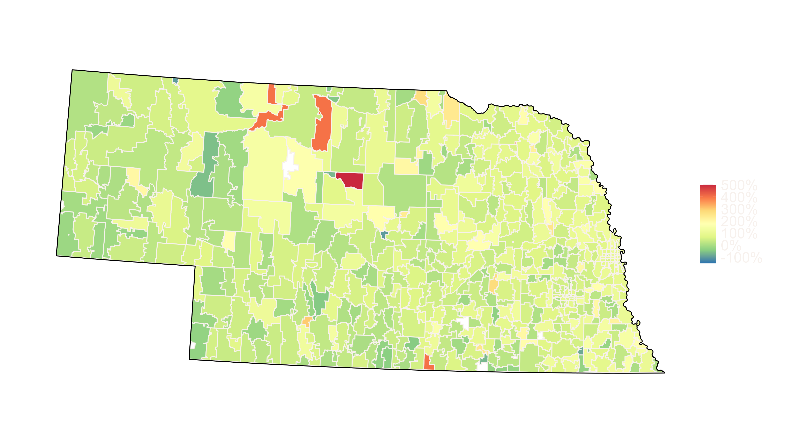
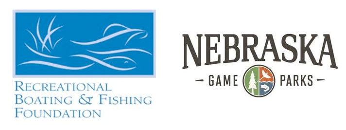

```{r setup, include=FALSE}
options(htmltools.dir.version = FALSE)
knitr::opts_chunk$set(
  fig.width=14, fig.height=5, fig.retina=3,
  fig.showtext = TRUE,
  out.width = "100%",
  cache = FALSE,
  echo = FALSE,
  message = FALSE, 
  warning = FALSE,
  hiline = TRUE
)

library(tidyverse)
library(ggtext)
library(sf)
library(xaringanthemer)


```

```{r xaringan-themer, include=FALSE, warning=FALSE}

style_duo(
  primary_color = "#1f1f22",
  secondary_color = "#f9f4f1",
  header_font_google = google_font("Martel"),
  header_color = "#b3a975",
  text_font_google = google_font("Lato"),
  code_font_google = google_font("Fira Mono"),
  base_font_size = "24px",
  colors = c(
    pathways = "#b0733b",
    green = "#31b09e",
    "green-dark" = "#2c8475",
    grey = "#d3d3d380",
    highlight = "#87f9bb",
    purple = "#887ba3",
    pink = "#B56B6F",
    orange = "#f79334",
    red = "#dc322f",
    black = "#000000",
    `blue-dark` = "#002b36",
    `text-dark` = "#202020",
    `text-darkish` = "#42424",
    `text-mild` = "#606060",
    `text-light` = "#9a9a9a",
    `text-lightest` = "#eaeaea")
  )

xaringanExtra::use_xaringan_extra(c("tile_view",  "tachyons"))
xaringanExtra::use_extra_styles()

theme_set(theme_xaringan())

theme_update(panel.grid = element_blank(),
        axis.line = element_line(color = "#d9d9d9", size =1),
        axis.ticks = element_line(color = "#d9d9d9", size =1),
        axis.text = element_text(color = "#d9d9d9", size = 20),
        plot.margin = margin(1,1,1,1, "cm"),
        plot.caption = element_markdown(lineheight = 1.2, size = 10))

```


background-image: url('img/social_distance_flyer1_lg.jpeg')
background-size: 35%
background-position:  85% 50%

class: title-slide

<style>
.title-slide .remark-slide-number {
  display: none;
}
</style>

.pull-left[
## <br>Fishing through the Pandemic <br>in Nebraska

### <br> .highlight[Christopher Chizinski and Matt Gruntorad]

#### <br>  <br>  <br> <br>  .pathways[*Pathways*] :: Recruitment, Retention, Reactivation]

<a href="https://chrischizinski.github.io/fishing-pandemic-pathways/" class="github-corner" aria-label="View source on Github"><svg width="80" height="80" viewBox="0 0 250 250" style="fill:#fff; color:#151513; position: absolute; top: 0; border: 0; right: 0;" aria-hidden="true"><path d="M0,0 L115,115 L130,115 L142,142 L250,250 L250,0 Z"></path><path d="M128.3,109.0 C113.8,99.7 119.0,89.6 119.0,89.6 C122.0,82.7 120.5,78.6 120.5,78.6 C119.2,72.0 123.4,76.3 123.4,76.3 C127.3,80.9 125.5,87.3 125.5,87.3 C122.9,97.6 130.6,101.9 134.4,103.2" fill="currentColor" style="transform-origin: 130px 106px;" class="octo-arm"></path><path d="M115.0,115.0 C114.9,115.1 118.7,116.5 119.8,115.4 L133.7,101.6 C136.9,99.2 139.9,98.4 142.2,98.6 C133.8,88.0 127.5,74.4 143.8,58.0 C148.5,53.4 154.0,51.2 159.7,51.0 C160.3,49.4 163.2,43.6 171.4,40.1 C171.4,40.1 176.1,42.5 178.8,56.2 C183.1,58.6 187.2,61.8 190.9,65.4 C194.5,69.0 197.7,73.2 200.1,77.6 C213.8,80.2 216.3,84.9 216.3,84.9 C212.7,93.1 206.9,96.0 205.4,96.6 C205.1,102.4 203.0,107.8 198.3,112.5 C181.9,128.9 168.3,122.5 157.7,114.1 C157.9,116.9 156.7,120.9 152.7,124.9 L141.0,136.5 C139.8,137.7 141.6,141.9 141.8,141.8 Z" fill="currentColor" class="octo-body"></path></svg></a><style>.github-corner:hover .octo-arm{animation:octocat-wave 560ms ease-in-out}@keyframes octocat-wave{0%,100%{transform:rotate(0)}20%,60%{transform:rotate(-25deg)}40%,80%{transform:rotate(10deg)}}@media (max-width:500px){.github-corner:hover .octo-arm{animation:none}.github-corner .octo-arm{animation:octocat-wave 560ms ease-in-out}}</style>


---
## Recreational budget in 2019

```{r recbudgets, fig.height = 6}

x = "recreational_sports"
format_labels <- function(x, sep = "_"){
  str_replace_all(x, sep, " ") -> x
  str_to_sentence(x)
  
  }

rec_budgets <- read_csv("data/recreationalBudgets.csv") %>% 
  filter(!activity %in% c("kids_mean8","bipoc","hisp","town_city","college","age","income_d", "female", "other")) %>% 
  mutate(activity = replace(activity, grepl("adv_sports",activity), "adventure_sports"),
         activity = replace(activity, grepl("recr_sports",activity), "recreational_sports"),
         activity2 = format_labels(activity),
         activity2 = fct_reorder(activity2, mean),
         ci_hi = mean + 1.96*se,
         ci_lo = mean - 1.96*se) %>% 
  mutate(myPalette = ifelse(activity %in%  c("fishing"),"#FFFF00","#f9f4f1"),
         Source2 = glue::glue("<span style='color:{myPalette}'>{activity2}</span>"),
         Source2 = factor(Source2),
         Source2 = fct_reorder(Source2, mean)) %>% 
  arrange(Source2)

ggplot(rec_budgets) + 
  geom_errorbar(aes(x = Source2, ymax = ci_hi, ymin = ci_lo), width = 0, size = 4.5, alpha = 0.25) + 
    geom_point(aes(x = Source2, y= mean), shape = 15, size = 5) +
  scale_y_continuous(breaks = seq(0,1,by = 0.10), labels = scales::label_percent(accuracy = 1)) +
  coord_flip(xlim = c(0.5,15.5), ylim = c(0,1), expand = FALSE) +
  labs(x = "Activities", y = "Percentage of NE population") +
  theme(axis.text.y = element_markdown(size = 18, hjust = 1)) -> rec_budget_plot


rec_budget_plot
```
<br>
.footnote[McFarlin, I. I. (2021). *Understanding and Contextualizing Foraging Among Recreational Opportunities in the North Central United States*. [Thesis, University of Nebraska-Lincoln]. https://digitalcommons.unl.edu/natresdiss/335/]

---
background-image: url('img/covid-unsplash.jpg')
background-size: 110%
--
.pull-right[
<br>
<br>
<br>
<br>

### The Covid pandemic had profound effects on how we used our spare time
  - travel ceased or restricted
  - canceled many of our usual activities
  - changed our work schedules
  - disrupted gathering in groups
]
---
class: center, middle

# How did the pandemic influence fishing in Nebraska?
---
## Fishing in Nebraska

.pull-left.b--dark-blue.ba.bw2.br3.shadow-5.ph4.mt3[
Everyone 16 and older needs a permit to fish legally in Nebraska.

<br>
Many options available:
 - resident and non-resident
 - single-day to lifetime permits
 - can be combined with hunting permits
<br>

Permit purchases can help inform the .highlight[*who*], .highlight[*what*], .highlight[*when*], and .highlight[*where*] of fishing in Nebraska]

.pull-right[
<br>
<br>
 
 ]
---

# Anglers fish NE from all over

 
---
# Trends across the years
```{r fishingtrends, fig.height = 7}
                                                                   data_snap <- feather::read_feather("/Volumes/Envoy Pro/data/PermitStampsCustomer202220201.feather")

good_permitz <- c("Hunt Fish Combo", "Fish")


data_snap %>% 
  filter(Year %in% c(2010:2021),
         Type %in% good_permitz,
         !is.na(resident)) %>% 
  mutate(lifeRange2 = ifelse(grepl("Day", lifeRange),"Daily","Annual(+)"),
         resident = ifelse(resident == "F","Non-resident", "Resident")) %>%
  group_by(Year, lifeRange2,resident) %>% 
  summarise(N = n_distinct(customerUID)) -> individuals_fish

pct = function(x, digits=0) {
  sprintf(paste0("%1.", digits, "f%%"), x)
}

individuals_fish %>% 
  filter(Year %in% c(2019,2020)) %>% 
  group_by(Year, resident) %>% 
  summarise(TTL = sum(N)) %>% 
  pivot_wider(names_from = Year, values_from = TTL) %>% 
  mutate(pct = pct((`2020`/`2019` -1)*100),
         Year = 2020,
         N = c(10000,75000)) -> pct_chg

individuals_fish %>% 
  ungroup() %>% 
  distinct(lifeRange2,resident) %>% 
  mutate(Year = c(2009.5,2021.5,2009.5,2021.5),
         N = ifelse(resident =="Resident", 232081,40000)) -> blanks

ggplot(individuals_fish) + 
  geom_col(aes(x = Year, N, fill = lifeRange2), color = "black") + 
  geom_blank(data = blanks, aes(x = Year, N, fill = lifeRange2)) +
  facet_wrap(~resident, nrow = 2, scales = "free_y") + 
  coord_cartesian(expand = FALSE) +
  scale_y_continuous(labels = scales::comma) +
  scale_x_continuous(breaks = 2010:2021) +
  scale_xaringan_fill_discrete() +
  labs(x = "Year", y = "Distinct individuals", fill = "") + 
  guides(fill = guide_legend(title.position = "top", 
                              # hjust = 0.5 centres the title horizontally
                              title.hjust = 0.5,
                              label.position = "bottom")) +
    theme(legend.position = "bottom",
        strip.background = element_blank(),
        strip.text = element_textbox(size = 28,
                                     color = "#1f1f22", 
                                     fill = "#91a5a4", 
                                     box.color = "#91a5a4",
                                     halign = 0.5,
                                     linetype = 1,
                                     r = unit(5, "pt"),
                                     width = unit(1, "npc"),
                                     padding = margin(2, 0, 1, 0), 
                                     margin = margin(3, 3, 3, 3))
        ) -> indv_over_time_plot


plot(indv_over_time_plot)

```
---
# Trends across the years

```{r fishingtrends2, fig.height = 7}

indv_over_time_plot + 
  geom_text(data = pct_chg, aes(x = Year, y = N, label = pct), color = "black", size = 10)
```

---
# Trends across the years

```{r fishingtrends3, fig.height = 7}
highlight_box <- tibble(xmin = 2019.5, xmax = 2020.5, ymin = 15539, ymax = 182081 + 50000, resident = "Resident")

indv_over_time_plot + 
  geom_text(data = pct_chg, aes(x = Year, y = N, label = pct), color = "black", size = 10) +
  geom_rect(data = highlight_box, aes(xmin = xmin, xmax = xmax, ymin = ymin, ymax = ymax), fill = "#FFFF00", alpha = 0.35)  
    
```

---
background-image: url('img/kearney.jpg')
background-size: contain


---
class: center, middle

# Who were these additional anglers that showed up in 2020?

---
background-image: url('img/kelly-sikkema-unsplash.jpg')
background-size: 100%
background-position:  25% 50%
# .black.bg-grey[Classifying anglers into the 3 R's]

.right.middle[

<br>
<br>
## .black[Recruited]
<br>

## .black[Reactivated]
<br>
## .black[Retained]
<br>

]
---
# R3 types by year
```{r r3types1, fig.height = 7}
R3_types_fish <- read_csv("/Volumes/Envoy Pro/data/fishR3type.csv")

R3_types_fish %>% 
  filter(!is.na(sex)) %>% 
  group_by(permitYear, r3_type) %>% 
  count() %>% 
  ungroup() %>% 
  complete(permitYear, nesting(r3_type), fill = list(n = 0)) %>% 
  group_by(permitYear) %>% 
  mutate(TTL = sum(n)) %>% 
  ungroup() %>% 
  mutate(perc = (n/TTL)*100) %>% 
  filter(permitYear != 2011) -> R3_fish_perc

ggplot(data = R3_fish_perc %>% filter(permitYear %in% c(2019:2021)), aes(x = permitYear, y = perc, fill = r3_type, label = pct(perc,0))) + 
  geom_col(color = "black",position = position_dodge(width = 0.9)) + 
  geom_text(aes(y = perc + 5), position = position_dodge(width = 0.9), size = 8) +
  geom_text(data = R3_fish_perc %>% filter(permitYear %in% c(2019:2021)) %>% distinct(permitYear,.keep_all = TRUE),
            aes(x = permitYear, y = 90, label = paste0("N=",prettyNum(TTL,big.mark=","))), size = 10) +
  # facet_wrap(~permitYear, ncol = 5, scales = "free_x") +
  coord_cartesian(ylim = c(0,100), xlim = c(2018.5, 2021.5), expand = FALSE) +
  scale_y_continuous(breaks = seq(0,100, by = 20)) +
  scale_x_continuous(breaks = seq(2019,2021, by = 1)) +
  scale_fill_manual("", values = c("reactivated" = "#3A86FF", "recruited" = "#8338EC", "retained" = "#FF006E")) +
      guides(fill = guide_legend(title.position = "top", 
                              # hjust = 0.5 centres the title horizontally
                              title.hjust = 0.5,
                              label.position = "bottom")) +
  labs(x = "Year", y = "Percentage", title = "Resident, annual+ fishing permits") + 
  theme(legend.position = "bottom",
        strip.text = element_textbox(size = 28,
                                     color = "#1f1f22", 
                                     fill = "#91a5a4", 
                                     box.color = "#91a5a4",
                                     halign = 0.5,
                                     linetype = 1,
                                     r = unit(5, "pt"),
                                     width = unit(1, "npc"),
                                     padding = margin(2, 0, 1, 0), 
                                     margin = margin(3, 3, 3, 3))) -> r3_plot

r3_plot + annotate("rect", xmin = 2019.5, xmax = 2021.5, ymin = 0, ymax = Inf, fill = "#1f1f22")
```
---
# R3 types by year

```{r r3types2, fig.height = 7}
r3_plot
```

---

# Angler characteristics

.pull-left[


]

<br>
<br>


---
# The *whys*

Broadly, there were no large shifts in the characteristics of who was fishing

--

These patterns do not tell us *why*  we saw the increase
--

<center>



</center> 
<br>
New anglers were sent a survey that sought to get at the *whys*
---
background-image: url('img/outwithFriends.png')
background-size: fill


# .black[The most important *whys*]

---
# Disruption of the recreational landscape

```{r recbudgetplot2, fig.height = 6}
rec_budget_plot
```

---
# Take home points

- Covid pandemic brought a record number of new anglers to NE waters
  - Primarily those that had lapsed
  - Many stayed in 2021

- Positive for funding sportfish restoration and aquatic habitat improvements

- Many of the reasons *why* were similar to other outdoor recreational activities: family and friends, outdoors, nature
  - The pandemic decreased the amount of competing activities

---
class: center, middle

This research was supported by several Federal Aid in Sport Fish and Wildlife Restoration projects, which were administered by the Nebraska Game and Parks Commission.

<br>
<br>
<br>
.red[cchizinski2@unl.edu] | .red[humandimensions.unl.edu]


